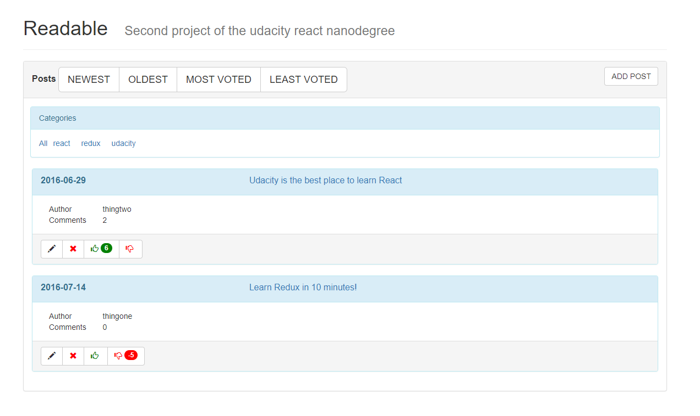
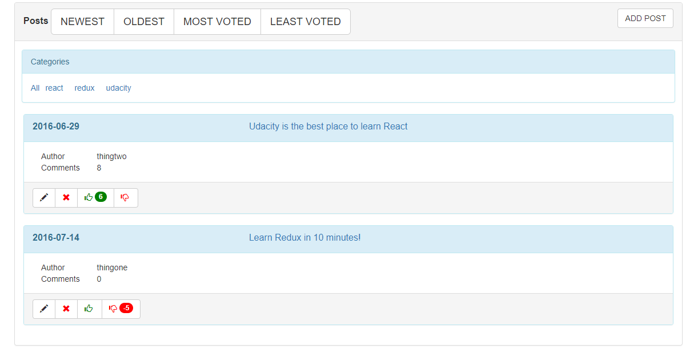
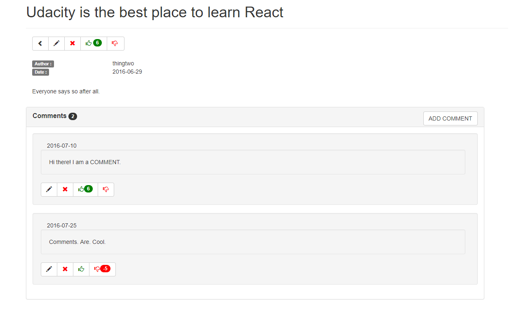

# Readable app frontend

## Project files

The app is built using create-react-app.The interface is implemented with React JS,with state management done with Redux and using 
react-bootstrap components for the layout. It includes the following files:

```
+--public/    
 |-- index.html - Updated to include the bootstrap css and to change the app title
 |-- favicon.ico - React Icon
+-- src/
 +-- actions/ - action types and action creators used in the app.
  |-- actionTypes.js - list of the application action types
  |-- index.js - application action creators
 +-- reducers/ - application reducers (for posts,comments and categories)
  |-- index.js - application reducers
 +-- utils
  |-- api.js - calls to the backend API for retrieving and management of categories,comments and posts 
  |-- helpers.js - Contains utility functions used in the application
 +-- components
  |-- App.js - Main application component.Renders the header,categories and posts components
  |-- Categories.js - Display of the posts' categories.Calls the action for filtering of posts by category
  |-- CommentDetails.js - Contains details for a comment and the buttons for edit,delete and voting for a comment
  |-- Comments.js - Main component for the comments.Contains a panel with comments header ,
  count of comments for a given post and a button for comments addition
  |-- CreateUpdateCommentDialog.js - Dialog for create/update of comments
  |-- CreateUpdatePostDialog.js - Add/edit posts dialog
  |-- NotFound.js - 404 page of the app
  |-- PostDetail.js - Displays detailed view for a post.Contains the post's body,voting mechanism and controls 
  for update and deletion.Also displays the comments made for a given post and allows the user to add,edit or delete comments 
  or vote for them.
  |-- Post.js - Author and comments count for a given post. Visible on the main view of the posts
  |-- Posts.js - Main component for viewing the posts.Contains a panel with nested collapsible panels 
  for the posts.The button for new posts addition is on the panel's header.At the posts panels' footer 
  are the buttons for post edit,deletion and voting.
  |-- Readable.js - Application main component.Contains the root view with the filters by category and
  the buttons for addition,sorting,edit and deletion of posts.Allows the user to vote for posts.
|-- .gitignore 
|-- README.MD - This README file.
|-- package.json - npm package manager file.
|-- package-lock.json - npm package manager file.Contains description of the dependencies of the modules 
used in the project.
```

## Readable frontend app functional description

The main screen of the readable app shows the buttons for sorting of the posts,the filters panel with the list
of categories for the posts and the posts panel with the button for adding a new post and the existing posts.



### Posts panel 



The posts panel displays the existing posts and allows the sorting,
addition,deletion,modification,upvoting and downvoting of posts.

### Sorting of posts 

To sort the displayed posts in a given way, you should use the buttons at
the panel's header.The possible sort orders are:
* NEWEST - By descending order of date 
* OLDEST - By ascending order of date 
* MOST VOTED - By descending vote score
* LEAST VOTED - by ascending vote score

#### Addition of new posts 

To add a new post,you should click the 'ADD POST' button on the posts panel.
A dialog will open , allowing you to enter the details of the post:


The fields for body,title and author are required. In case one or more of them does not have a value,the addition cannot be confirmed:


To add the new post,press the CONFIRM button.The post will appear on the main screen of the app.

#### Edition,deletion and voting for a post

The button toolbar found at the footer of a given post's panel allows the user to edit a post,delete it, vote for or against it: 


The vote score of a post is displayed in the following way : 
 - if the vote score is positive - inside a green badge,on the button for upvoting a post 
 - if the vote score is negative - in a red badge,on the button for voting against a post.

#### Edit post dialog

The user can edit a comment by pressing the edit button (pencil icon) on the toolbar found in the post panel's footer.The add/edit post dialog opens:


The title and body fields are required.If any/all of them do not have a value on dialog confirmation, they will be highlighted in red: 


To update the post,the user should press the CONFIRM button

#### Post details 

Clicking the header of the panel for a given post takes you to the post's
detail page: 



The details for a post contain the post's author,date,body and comments(if present).The badge next to the 'Comments' label shows the comments count for a post.The button in the right of the row allows the user to add a new comment.

By using the toolbar under the post's title,you can :
* Go back to the main screen 
* Edit the displayed post 
* Delete the post
* Upvote it 
* Downvote it 


When you delete a post from the details screen,its URL becomes inaccessible and you are taken back to the main screen

#### Adding a new comment

Pressing the button 'ADD COMMENT' opens a modal dialog for adding a new comment to a post : 


The fields for body and author are required,so the user will not be able to confirm the addition if any/all of them are empty : 


To add the comment,press the CONFIRM button.The comment will appear in the list of comments for the given post.

### Comments panel 


#### Edition,deletion and voting for a comment

The button toolbar below a comment's body allows the user to edit a comment,delete it, upvote or downvote it: 


The vote score of a comment is displayed in the following way : 
 - if the vote score is positive - inside a green badge,on the button for upvoting a comment 
 - if the vote score is negative - in a red badge,on the button for voting against a comment.

#### Edit comment dialog

The user can edit a comment by pressing the edit button (pencil icon) on the toolbar found below a comment's body.The add/edit comment dialog opens:


The body field is required.If it does not have a value on dialog confirmation , it is highlighted in red : 


To update the comment,the user should press the CONFIRM button